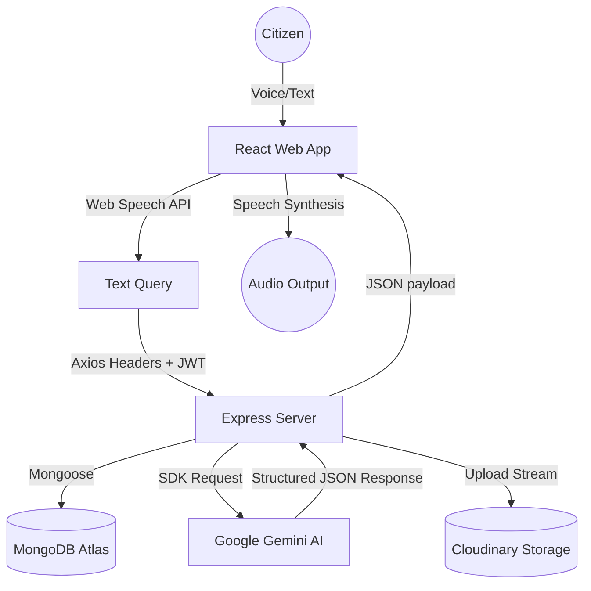

# 🚀 Seva Setu AI

> **Government Services. One Conversation Away.**
> A Voice-First AI Civic Assistant designed for rural citizens, elderly people, and users with low digital literacy.

---

## 📌 Problem Statement
Accessing government welfare services, schemes, and documentation guidelines in India is currently a complex task. Citizens must navigate cluttered, jargon-filled official portals, often in languages they are not fluent in. This disproportionately affects:
* Rural citizens
* Elderly populations
* First-time internet users
* Citizens with low literacy

## 💡 Inspiration
The inspiration for **Seva Setu AI** stems from the need to democratize access to digital civic services. By creating an interface that behaves like a helpful local assistant who speaks the user's native tongue (English, Hindi, or Marathi) and listens to voice queries, we bridge the digital divide and foster social and economic inclusion.

---

## 🛠️ Tech Stack
* **Frontend**: React (Vite), Tailwind CSS v4, React Router, Axios, Framer Motion, React Icons
* **Backend**: Node.js, Express.js, MongoDB Atlas (Mongoose)
* **Authentication**: JWT (JSON Web Tokens)
* **AI Intelligence**: Google Gemini AI API (`gemini-1.5-flash`)
* **Voice**: Web Speech API (`SpeechRecognition` & `SpeechSynthesis`)
* **Cloud Storage**: Cloudinary (for complaint evidence photos)

---

## 🌟 Key Features
1. **🎤 Voice-First AI Assistant**: Click-to-talk microphone inputs in English, Hindi, and Marathi. Gemini processes the query and the assistant reads the response aloud using Speech Synthesis.
2. **📄 AI Document Checklist Generator**: Enter a service (e.g. "Passport") and instantly receive a checklist with checkboxes, progress bars, and warnings about common errors.
3. **📝 Voice Complaint Generator**: Speak a grievance (e.g., "water leakage in my area"). AI structures the complaint, identifies the department, assigns priority, suggests subjects, and allows attaching evidence photos before submitting.
4. **🎯 Personalized Scheme Recommendations**: Provide age, occupation, and income parameters to get tailored welfare suggestions. Schemes can be bookmarked and viewed on the user's profile.
5. **📚 Explain Simply (ELI12)**: Every AI response includes a standard view, a simplified (Explain Like I'm 12) view, and a quick bullet points summary.
6. **🌐 Advanced Accessibility**: Toggle dark mode, high contrast themes, and text size scaling (A-, A, A+) to accommodate users with low vision or cognitive differences.

---

## 🏗️ Architecture Flow


---

## ⚙️ Installation & Configuration

### Prerequisites
* Node.js (v18+)
* MongoDB Atlas cluster
* Google Gemini API Key

### Backend Setup
1. Open the `/server` directory:
   ```bash
   cd server
   ```
2. Install dependencies:
   ```bash
   npm install
   ```
3. Create a `.env` file in the `/server` folder:
   ```env
   PORT=5000
   MONGODB_URI=your_mongodb_atlas_uri
   JWT_SECRET=your_jwt_secret_key
   GEMINI_API_KEY=your_gemini_api_key
   CLOUDINARY_CLOUD_NAME=your_cloudinary_cloud_name
   CLOUDINARY_API_KEY=your_cloudinary_api_key
   CLOUDINARY_API_SECRET=your_cloudinary_api_secret
   ```
4. Start the server:
   ```bash
   npm run start
   ```

### Frontend Setup
1. Open the `/client` directory:
   ```bash
   cd client
   ```
2. Install dependencies:
   ```bash
   npm install
   ```
3. Start the Vite development server:
   ```bash
   npm run dev
   ```

---

## 📡 API Endpoints

### 🔐 Authentication
* `POST /api/auth/register` - Create user account
* `POST /api/auth/login` - Authenticate user & get JWT token

### 💬 Chat & Checklist
* `POST /api/chat` - Talk to AI assistant (returns standard, simple, and summary responses)
* `GET /api/chat/history` - Retrieve user conversation history
* `POST /api/chat/checklist` - Get document checklists for a specific service

### 📝 Complaints
* `POST /api/complaint` - Submit a complaint (analyzes via AI, uploads image to Cloudinary)
* `GET /api/complaint` - Get user complaints history
* `PATCH /api/complaint/:id` - Edit status (Pending -> In Review -> Resolved)
* `DELETE /api/complaint/:id` - Delete a complaint

### 🎯 Schemes
* `POST /api/schemes/recommend` - Demographics scheme search
* `GET /api/schemes/saved` - Get bookmarked schemes
* `POST /api/schemes/save` - Save/Bookmark a scheme
* `DELETE /api/schemes/saved/:id` - Unsave a scheme

---

## 🔮 Future Scope
* **Offline Localization**: Integrate on-device speech models for zero-connectivity scenarios.
* **OCR Document Verification**: OCR scanners to verify uploaded applications against standard checklists.
* **Geomapping**: Localize civic complaint spots onto heatmaps for municipal authorities.
* **PDF Summarization**: Upload scanned PDF government notices and receive simplified audio summaries.

---

## 👥 Devengers Team
* **Project Lead**: AI Assistant & Pairing Developer
* **Collaborator**: User Devengers
* *Built for the Hackathon Demo with ❤️*
